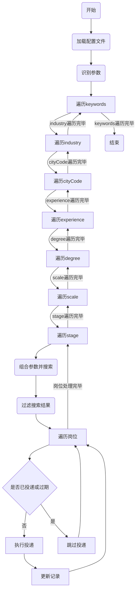

# 🍀Get Jobs【Boss直聘自动化投递增强版】

## 项目简介

本项目是一款专为程序员/技术岗位打造的**自动化智能投递工具**，支持Boss直聘、猎聘、拉勾、智联招聘、51Job等主流招聘平台。通过AI智能打招呼、自动筛选岗位、批量高效投递、企业微信实时推送等功能，极大提升找工作效率和投递命中率。

## 核心功能

### 1. 多平台批量自动投递
- **全面平台支持**：Boss直聘、猎聘、拉勾、智联招聘、51Job等主流招聘平台
- **统一配置管理**：所有平台参数集中在config.yaml文件，一处配置全局生效
- **灵活搜索策略**：支持对 **关键词 (keywords)、城市 (cityCode)、工作经验 (experience)、薪资区间 (salary)、学历 (degree)、公司规模 (scale)、融资阶段 (stage)** 等多项参数进行多选配置。系统将按照配置文件中的顺序，对这些多选参数进行全排列组合轮询搜索和投递，实现更精细化和全面的搜索覆盖。
- **投递去重机制**：支持设置 `deliverExpireDays` 控制投递记录的过期天数，过期后可重新投递。**投递唯一标识升级为"公司+岗位核心名+薪资核心区间+时间戳"**，更精确避免短期重复投递。`appliedJobs` 字段自动管理，支持纵向美化显示和手动清空。
- **批量投递控制**：支持间隔时间设置，防止账号被风控

### 2. AI智能打招呼与匹配分析
- **智能招呼语生成**：自动分析岗位JD与用户简历，生成针对性打招呼语
- **岗位匹配度判断**：自动评估岗位与用户经历匹配程度，过滤不匹配岗位
- **多模型API支持**：兼容OpenAI、国内大模型等多种API接口
- **自定义提示词**：用户可灵活调整AI生成内容的风格和侧重点
- **请求异常处理**：超时控制、重试机制和兜底方案，确保流程不中断

### 3. 智能黑名单与筛选系统
- **多维度黑名单**：支持公司、岗位、招聘者、**以及新增的公司+招聘者组合黑名单**，可灵活配置（字符串永久拉黑或对象临时拉黑）。
- **强大过滤规则**：支持**正则表达式匹配**黑名单关键词，过滤逻辑已优化，去除空白和特殊字符，确保公司/岗位/招聘者名称只要包含黑名单关键词就会被过滤。
- **灵活配置方式**：支持字符串（永久拉黑）和对象（临时拉黑）两种方式
  ```yaml
  # 字符串方式（永久拉黑）
  - "某公司C"
  # 对象方式（临时拉黑7天）
  - name: "公司B"
    days: 7
  ```
- **公司黑名单支持自动去除后缀和括号，模糊匹配所有相关单位。**
- **投递去重记录自动持久化到data.json，支持手动清空。**
- **自动拉黑机制**：收到"不合适"等反馈后自动加入黑名单，设置拉黑时效
- **黑名单时效管理**：自动记录拉黑时间和剩余天数，到期自动恢复投递资格
- **HR活跃度过滤**：自动检测并过滤长时间未活跃的HR，提高投递效率

### 4. 数据标准化与格式优化
- **招聘者信息标准化**：自动拼接为"真实姓名 | 公司名称 | 岗位"格式
- **岗位内容结构化**：职责、要求等内容按序号分行输出，提升可读性
- **Markdown格式输出**：岗位详情保存为结构化文档，便于查阅分析

### 5. 图片简历自动发送
- **一键发送图片简历**：主动发送图片简历，提高HR查看率
- **PDF转图片支持**：自动将PDF简历转为图片格式，兼容各平台要求
- **简单配置即用**：在config.yaml中开启选项，放置简历图片即可

### 6. 企业微信/Bark多渠道推送
- **多渠道通知**：同时支持企业微信和iOS Bark推送，信息实时同步
- **丰富通知类型**：包括投递成功、异常报警、岗位分析、黑名单变更等
- **格式化推送模板**：多种推送模板，信息层次清晰，重点突出

### 7. 稳定性与异常处理
- **元素定位与重试**：多重选择器定位和重试机制，提高页面操作成功率
- **消息发送确认**：确保招呼语真正发出后再继续流程
- **随机行为模拟**：通过随机延迟、鼠标移动模拟真人行为，降低封号风险
- **流程异常兜底**：针对各种异常情况设置自动重试和恢复机制

### 8. 安全与隐私保护
- **数据加密存储**：Cookie和登录信息加密保存，保障账号安全
- **日志信息脱敏**：自动对敏感信息如手机号、邮箱进行脱敏处理
- **跨设备兼容**：自动识别操作系统类型，适配不同环境和浏览器

## 【Boss直聘自动化投递详细轮询逻辑】

本系统的岗位搜索与投递采用多维度全排列嵌套轮询，确保所有配置组合都能被遍历和投递。以下为详细的嵌套循环逻辑说明：

### 1. 关键词循环（keywords）
> **循环逻辑**：依次从 `keywords` 列表中取出每一个关键词，固定为当前搜索关键词，进入下层 `industry` 循环。下层及其所有内部循环全部完成后，回到本层，取下一个关键词，直到 `keywords` 列表遍历完毕。
> 
> **伪代码**：
> ```python
> for keyword in keywords:
>     # 固定当前keyword，进入industry循环
> ```
> **示例**：当前keyword="售前"，进入industry循环...
> 
> **取值**：售前、解决方案、售前工程师、解决方案工程师、售前经理、解决方案经理、售前主管、解决方案主管、售前总监、解决方案总监、项目经理、项目总监

### 2. 行业循环（industry）
> **循环逻辑**：对于当前keyword，依次从 `industry` 列表中取出每一个行业，固定为当前行业，进入下层 `cityCode` 循环。下层及其所有内部循环全部完成后，回到本层，取下一个行业，直到 `industry` 列表遍历完毕。
> 
> **伪代码**：
> ```python
> for industry in industry_list:
>     # 固定当前industry，进入cityCode循环
> ```
> **示例**：当前keyword="售前"，industry="不限"，进入cityCode循环...
> 
> **取值**：不限

### 3. 城市循环（cityCode）
> **循环逻辑**：对于当前keyword和industry，依次从 `cityCode` 列表中取出每一个城市，固定为当前城市，进入下层 `experience` 循环。下层及其所有内部循环全部完成后，回到本层，取下一个城市，直到 `cityCode` 列表遍历完毕。
> 
> **伪代码**：
> ```python
> for city in cityCode_list:
>     # 固定当前city，进入experience循环
> ```
> **示例**：当前keyword="售前"，industry="不限"，city="厦门"，进入experience循环...
> 
> **取值**：厦门、泉州、福州、深圳、成都

### 4. 工作经验循环（experience）
> **循环逻辑**：对于当前keyword、industry、city，依次从 `experience` 列表中取出每一个工作经验选项，固定为当前经验，进入下层 `degree` 循环。下层及其所有内部循环全部完成后，回到本层，取下一个经验，直到 `experience` 列表遍历完毕。
> 
> **伪代码**：
> ```python
> for exp in experience_list:
>     # 固定当前exp，进入degree循环
> ```
> **示例**：当前keyword="售前"，industry="不限"，city="厦门"，experience="不限"，进入degree循环...
> 
> **取值**：不限、应届毕业生、1年以下、1-3年、3-5年、5-10年、10年以上

### 5. 学历循环（degree）
> **循环逻辑**：对于当前keyword、industry、city、experience，依次从 `degree` 列表中取出每一个学历选项，固定为当前学历，进入下层 `scale` 循环。下层及其所有内部循环全部完成后，回到本层，取下一个学历，直到 `degree` 列表遍历完毕。
> 
> **伪代码**：
> ```python
> for deg in degree_list:
>     # 固定当前deg，进入scale循环
> ```
> **示例**：当前keyword="售前"，industry="不限"，city="厦门"，experience="不限"，degree="大专"，进入scale循环...
> 
> **取值**：大专、本科、硕士

### 6. 公司规模循环（scale）
> **循环逻辑**：对于当前keyword、industry、city、experience、degree，依次从 `scale` 列表中取出每一个公司规模选项，固定为当前规模，进入下层 `stage` 循环。下层循环全部完成后，回到本层，取下一个规模，直到 `scale` 列表遍历完毕。
> 
> **伪代码**：
> ```python
> for scale in scale_list:
>     # 固定当前scale，进入stage循环
> ```
> **示例**：当前keyword="售前"，industry="不限"，city="厦门"，experience="不限"，degree="大专"，scale="0-20人"，进入stage循环...
> 
> **取值**：0-20人、20-99人、100-499人、500-999人、1000-9999人、10000人以上、不限

### 7. 融资阶段循环（stage）
> **循环逻辑**：对于当前keyword、industry、city、experience、degree、scale，依次从 `stage` 列表中取出每一个融资阶段选项，固定为当前stage，进入最内层搜索与投递流程。每个stage处理完毕后，回到本层，取下一个stage，直到 `stage` 列表遍历完毕。
> 
> **伪代码**：
> ```python
> for stage in stage_list:
>     # 固定当前stage，进入搜索与投递流程
> ```
> **示例**：当前keyword="售前"，industry="不限"，city="厦门"，experience="不限"，degree="大专"，scale="0-20人"，stage="不限"，进入搜索与投递流程...
> 
> **取值**：不限、未融资、天使轮、A轮、B轮、C轮、D轮及以上、已上市、不需要融资

---

#### 参数组合示例
> 关键词=售前，行业=不限，城市=厦门，经验=不限，学历=大专，规模=0-20人，融资=不限

---

#### 搜索与投递流程
1. 每当最内层循环确定一个完整参数组合（如上示例），系统立即用该组合在Boss直聘平台执行一次岗位搜索。
2. 对搜索结果依次应用多重过滤：
   - 期望薪资：岗位最高薪资需≥配置最低薪资
   - HR活跃度：过滤不活跃招聘者
   - 关键词匹配：岗位名称需包含完整搜索关键词
   - 黑名单：公司/岗位/招聘者/公司+招聘者命中黑名单（支持正则）
3. 遍历所有通过过滤的岗位，检查是否已投递且未过期（唯一标识=公司+岗位核心名+薪资核心区间+时间戳，结合deliverExpireDays），如未投递或已过期则执行投递并记录，否则跳过。
4. 当前参数组合下所有岗位处理完毕后，回到stage循环，依次尝试下一个stage，直至所有参数全排列遍历完毕。

---

> 本流程确保所有配置条件下的岗位都能被搜索和投递，且通过去重机制避免短期重复投递。

## 【Boss直聘自动化投递详细流程图（Mermaid可视化）】



> 支持的平台（如GitHub、Gitee）会自动渲染为可视化流程图。若未渲染，可用Mermaid Live Editor等工具查看。

## 近期功能更新

- **黑名单过滤增强**: 新增支持正则表达式匹配，极大提升过滤的灵活性和准确性。同时兼容原有字符串配置，无需修改老配置。过滤逻辑已优化，去除空白和特殊字符，确保公司/岗位/招聘者名称只要包含黑名单关键词就会被过滤。
- **投递去重优化**: 投递唯一标识升级为"公司+岗位核心名+薪资核心区间+时间戳"，更精确地识别重复投递。新增 `deliverExpireDays` 配置项，支持设置投递记录的过期天数，过期后可重新投递。`appliedJobs` 字段现在自动纵向排列，格式美观，支持手动清空或编辑。
- **薪资区间多选与遍历**: `salary` 字段支持数组形式配置多个薪资区间（如 `[ "10-20K", "20-50K" ]`），系统将自动遍历所有配置的薪资区间进行岗位搜索和投递。兼容原有单字符串配置。修复了薪资解析的 bug，确保薪资区间格式正确。
- **多维参数全排列轮询**: `experience`（工作经验）、`salary`（薪资区间）、`scale`（公司规模）等字段现在均支持数组形式的多选配置，系统将按照配置文件中的配置顺序，对所有多选参数进行全排列组合轮询，实现更精细化的搜索策略。
- **日志优化**: 投递日志中增加了公司、岗位、薪资区间、招聘官等详细信息，方便用户追踪投递过程。
- **搜索参数扩展**: `experience` (工作经验) 和 `stage` (融资阶段) 字段已补充 Boss PC 网页端支持的所有选项，并加入多维度全排列轮询。
- **黑名单功能升级**：新增公司+招聘者组合黑名单，支持临时和永久拉黑
- **配置兼容性增强**：黑名单项支持字符串与对象混合配置，自动识别反序列化
- **移动端H5支持**：全面支持Boss直聘移动端版本，兼容PC与移动双渠道投递
- **数据持久化改进**：黑名单、投递记录等数据自动持久化，程序重启不丢失
- **异常处理优化**：关键流程增加异常捕获和详细日志，提高运行稳定性
- **公司黑名单过滤增强**：公司名自动去除"有限公司""公司""集团"等后缀及括号、空格，支持模糊匹配，配置"核心公司名"即可屏蔽所有相关单位。
- **投递去重记录迁移**：appliedJobs投递去重记录从config.yaml迁移到data.json，支持自动持久化，配置文件只需控制是否允许重复投递。
- **投递去重可手动清空**：appliedJobs可手动清空，支持灵活控制历史投递。
- **主流程异常捕获增强**：每个岗位异常单独捕获，日志详细，单个岗位异常不影响整体流程。
- **支持同公司不同招聘者同岗位可重复投递**：同公司同招聘者同岗位不重复投递，不同招聘者可重复。
- **黑名单配置兼容字符串和对象方式，支持有效期。**

## 配置文件示例

```yaml
# config.yaml 关键配置（简化版）
boss:
  debugger: false # 开发者模式
  h5Jobs: true    # 是否启用H5版本
  sayHi: "您好，我叫光光..." # 默认打招呼语
  keywords: ["售前", "解决方案"] # 搜索职位关键词
  cityCode: ["深圳", "广州"] # 搜索城市
  experience: ["3-5年", "5-10年"] # 工作经验筛选
  salary: "20-50K" # 薪资筛选
  filterDeadHR: true # 过滤不活跃HR
  enableAI: true # 启用AI生成招呼语
  sendImgResume: true # 发送图片简历
  allowRepeatApply: false # 是否允许重复投递

ai:
  introduce: "我擅长企业级解决方案..." # 个人介绍
  prompt: "我目前在找工作,%s..." # AI提示词模板

bot:
  is_send: true # 企业微信推送
  is_bark_send: true # Bark推送
```

## 快速开始

1. 克隆仓库  
   ```bash
   git clone https://github.com/xiaopeng5203/get_job.git
   cd get_job
   ```
2. 配置环境（JDK21、Maven、Chrome/ChromeDriver）
3. 修改 `src/main/resources/config.yaml`，填写你的岗位、城市、AI参数等
4. 运行对应平台的主类（如 Boss.java、MobileBoss.java 等）
5. 查看企业微信/Bark推送和日志，掌握投递进展

详细使用说明请见 [README](./README.md) 及 [doc/](./doc/) 目录。

## 技术亮点

- Playwright/Selenium自动化实现，兼容多平台和频繁的前端变动
- 配置驱动设计，无需编码即可完成全部投递策略调整
- AI大模型集成，生成针对性招呼语，提高回复率
- 企业微信/Bark多渠道推送，实时跟踪投递状态
- 黑名单自动管理，避免无效投递，提高效率
- 图片简历自动发送，增加HR查看率和关注度
- 异常处理机制完善，保证流程稳定可靠

## 适用人群

- 正在求职的程序员/技术岗位人才
- 需要批量高效投递简历的求职者
- 希望通过AI提升简历投递回复率的用户

## 贡献与交流

- 欢迎Star、Fork、提Issue、提PR！
- QQ交流群：见项目内二维码
- 遇到问题请在Issues区反馈

## 开源协议

本项目遵循MIT协议，完全开源免费，禁止任何形式的倒卖和商业诈骗。

**让AI帮你高效找工作，Get Jobs，Get Offer！**

## 作者

光光

## 功能优化与推送说明

### 1. Bark推送内容格式优化
- 推送内容包含：
  - 今日投递总数
  - 用时
  - 每个岗位的详细信息（岗位名称、公司、薪资、工作地点）
  - 结尾祝福语
- 推送格式示例：
  ```
  【Boss直聘】今日投递汇总
  共发起 5 个聊天，用时 1小时23分
  -------------------------
  1. 高级Java开发 @ 字节跳动 | 30-40K·16薪 | 北京
  2. 算法工程师 @ 腾讯 | 35-50K·15薪 | 深圳
  ...
  -------------------------
  祝你早日找到心仪的工作！
  ```

### 2. 达到每日沟通上限时自动终止与推送
- 当检测到"沟通已达上限"时，系统会：
  1. 自动关闭所有窗口，终止流程
  2. 自动推送上述详细内容到Bark
- 兼容主流程和`printResult`场景，推送内容始终一致

### 3. 岗位详情推送内容丰富
- 每个岗位推送条目包含：岗位名称、公司、薪资、工作地点，信息一目了然

如需调整推送内容格式或增加其他字段，请修改`Boss.java`中的相关推送逻辑。